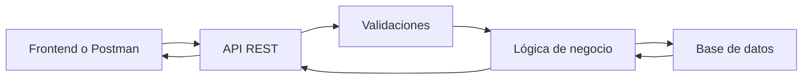

# UserManager API - Diseño inicial

## Descripción

UserManager API es una API REST para gestionar usuarios de una aplicación.
Permitirá registrar usuarios, iniciar sesión, consultar perfiles, modificar
datos, gestionar roles y proteger rutas privadas mediante autenticación.

| Recurso   | Explicación                                                  |
| --------- | ------------------------------------------------------------ |
| `/auth`   | Servirá para registrar usuarios e iniciar sesión             |
| `/users`  | Servirá para consultar, crear, modificar y eliminar usuarios |
| `/health` | Servirá para comprobar que la API está funcionando           |

## Modelo de usuario

| Campo          | Explicación                                    |
| -------------- | ---------------------------------------------- |
| `id`           | Identificador único del usuario                |
| `name`         | Nombre completo del usuario                    |
| `email`        | Correo electrónico del usuario                 |
| `passwordHash` | Contraseña cifrada                             |
| `role`         | Rol del usuario, `USER` o `ADMIN`              |
| `isActive`     | Indica si el usuario está activo o desactivado |
| `createdAt`    | Fecha de creación                              |
| `updatedAt`    | Fecha de última modificación                   |

## Endpoints principales

| Método   | Ruta                     | Descripción                    | Acceso                   |
| -------- | ------------------------ | ------------------------------ | ------------------------ |
| `GET`    | `/api/health`            | Comprueba si la API funciona   | Público                  |
| `POST`   | `/api/auth/register`     | Registra un usuario            | Público                  |
| `POST`   | `/api/auth/login`        | Inicia sesión                  | Público                  |
| `GET`    | `/api/users/me`          | Consulta mi perfil             | Usuario autenticado      |
| `GET`    | `/api/users`             | Lista todos los usuarios       | `ADMIN`                  |
| `GET`    | `/api/users/:id`         | Consulta un usuario por ID     | `ADMIN` o propio usuario |
| `PATCH`  | `/api/users/:id`         | Modifica un usuario            | `ADMIN` o propio usuario |
| `DELETE` | `/api/users/:id`         | Elimina o desactiva un usuario | `ADMIN`                  |
| `PATCH`  | `/api/users/me/password` | Cambia mi contraseña           | Usuario autenticado      |
| `PATCH`  | `/api/users/:id/role`    | Cambia el rol de un usuario    | `ADMIN`                  |
| `PATCH`  | `/api/users/:id/status`  | Activa o desactiva un usuario  | `ADMIN`                  |

## Flujo general



El cliente envía una petición a la API. La API valida los datos, aplica la
lógica necesaria, consulta o modifica la base de datos y devuelve una respuesta.

## Reglas iniciales

- El email no se puede repetir.
- La contraseña debe tener al menos 8 caracteres + un cáracter especial.
- La contraseña no se guarda en texto plano.
- La API nunca devuelve `passwordHash`.
- Un `USER` solo puede acceder a su propia información.
- Un `ADMIN` puede gestionar usuarios.
- Un usuario inactivo no puede iniciar sesión.
- Un usuario no puede cambiar su propio rol.

## Errores posibles

- Intentar registrar un usuario con un email que ya existe → 409 Conflict
- Iniciar sesión con una contraseña incorrecta → 401 Unauthorized

## Respuesta JSON de GET /api/users/me

Ruta:

```
GET /api/users/me
```

Ejemplo de respuesta:

```json
{
  "id": 1,
  "name": "Ana García",
  "email": "ana@email.com",
  "role": "USER",
  "isActive": true,
  "createdAt": "2026-01-01T10:00:00.000Z"
}
```
